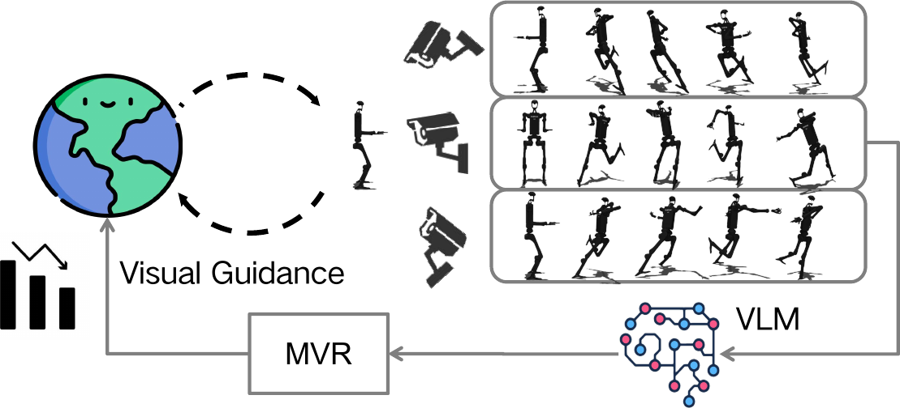

<div align="center">

# MVR: Multi-view Video Reward Shaping for Reinforcement Learning

## 🎉 Accepted at ICLR 2026 🎉

**Official JAX implementation of MVR**

**Lirui Luo · Guoxi Zhang · Hongming Xu · Yaodong Yang · Cong Fang · Qing Li**

[](https://openreview.net/forum?id=7lw6s9ELfr)
[](https://mvr-rl.github.io/)
[](https://mvr-rl.github.io/assets/MVR_ICLR2026.pdf)
[](https://openreview.net/forum?id=7lw6s9ELfr)
[](LICENSE)

</div>

<p align="center">
  
</p>

> **TL;DR** MVR is centered on **state-dependent reward shaping**: it learns state relevance from multi-view videos with a frozen vision-language model, then uses that relevance to provide dense guidance early in training while automatically fading as the target behavior emerges.

## Overview

The main idea of MVR is a **state-dependent reward shaping formulation** that integrates task rewards with VLM-based visual guidance without persistently distorting the task objective. Multi-view videos and learned state relevance are the key ingredients that make this shaping signal reliable for dynamic behaviors, robust to occlusion, and naturally self-decaying as performance improves. This repository contains the training code used to learn MVR on **HumanoidBench** and **MetaWorld** with **ViCLIP** and **TQC in JAX**.

## Quick Start

```bash
uv venv --python 3.11
source .venv/bin/activate
uv sync --frozen --no-install-project
python download_viclip.py
bash scripts/mvr/run_mvr-metaworld.sh
```

## Highlights

- **State-dependent reward shaping** that combines task rewards with learned visual guidance
- Automatic decay of the shaping term as the policy approaches the target behavior
- Multi-view video relevance learning with ViCLIP to handle dynamic motions and occlusion
- TQC-based reinforcement learning in JAX with experiment scripts for MetaWorld and HumanoidBench

## Installation

### Prerequisites

1. Python `3.11`
2. `uv` for environment management: `https://github.com/astral-sh/uv`
3. NVIDIA GPU with CUDA-compatible drivers for accelerated training
4. A C/C++ toolchain for packages that build native extensions

### Environment setup

From the repository root:

```bash
uv venv --python 3.11
source .venv/bin/activate
uv sync --frozen --no-install-project
```

`--no-install-project` avoids installing this repository as an editable package, which prevents a module-name collision with ViCLIP's `utils` package during checkpoint loading.

### Verify JAX GPU setup

```bash
python -c "import jax; print('JAX version:', jax.__version__); print('JAX devices:', jax.devices()); print('JAX backend:', jax.default_backend())"
```

Expected output should show a CUDA device and `gpu` backend.

## Download pretrained ViCLIP weights

```bash
python download_viclip.py
```

The default checkpoint path is `ckpts/ViCLIP/ViCLIP-L_InternVid-FLT-10M.pth`.

## Running experiments

### MetaWorld MVR

```bash
bash scripts/mvr/run_mvr-metaworld.sh
```

### HumanoidBench MVR

```bash
bash scripts/mvr/run_mvr.sh
```

### TQC baselines

```bash
bash scripts/tqc/run_tqc_metaworld.sh
bash scripts/tqc/run_tqc.sh
```

Outputs are written under `outputs/<algo>/<timestamp>/<run_name>/<env_name>/`.

## Citation

If you find this repository useful, please cite:

```bibtex
@inproceedings{luo2026mvr,
  title        = {MVR: Multi-view Video Reward Shaping for Reinforcement Learning},
  author       = {Luo, Lirui and Zhang, Guoxi and Xu, Hongming and Yang, Yaodong and Fang, Cong and Li, Qing},
  booktitle    = {International Conference on Learning Representations},
  year         = {2026}
}
```
